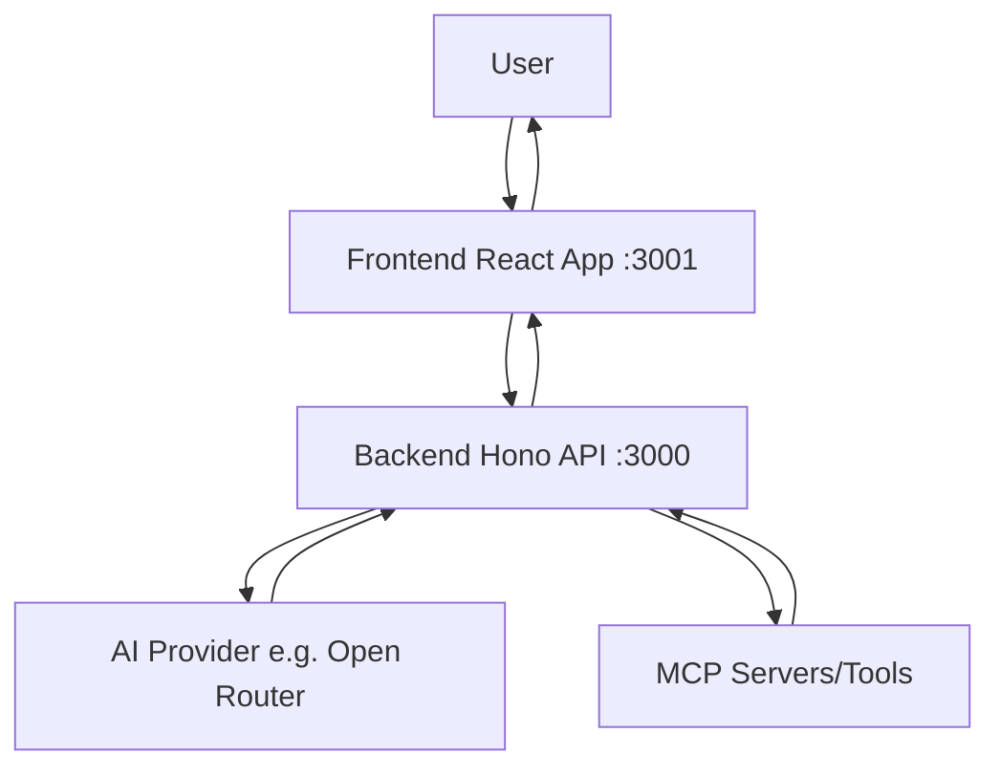

# AGENTS.md - open-chat

## What this is
Guidance for Agents when working with this repository. Keep answers concise, verify commands, and prefer links to source over duplication.

## Quickstart commands
- Install: `bun install`
- Dev: `bun dev` (starts both web on :3001 and server on :3000)
- Build: `bun run --filter '*' build`
- Start/Preview: `bun dev:web` for web only; `bun dev:server` for server only
- Test: No tests configured yet
- Lint: `oxlint` (root-level linting)
- Types: `bun check-types` for TypeScript across apps
- PWA Assets: `cd apps/web && bun generate-pwa-assets`

## Architecture overview
Frontend (React + Vite + TanStack Router) communicates with backend (Hono API) for AI chat functionality, integrated with MCP client via forked use-mcp hook for tools/prompts/resources, following ai-sdk standards.

- Framework: React on Vite for frontend; Hono on Node for backend.
- Rendering: Client-side rendering with API calls.
- Data flow: User input → Frontend (use-mcp hook) → Backend API → AI provider/MCP servers → Response back.
- Key modules: `apps/web/src/components/ai-elements/` for chat UI; `apps/server/src/routers/` for API endpoints; `apps/web/src/hooks/use-mcp.ts` for MCP integration; `apps/server/src/lib/mcp-registry/` for MCP registry handling.

## Environment and configuration
- Runtime: Node.js (via Bun 1.2.21), package manager: Bun.
- Env files: `.env.local` for local dev; CI/hosting secrets for preview/prod.
- Required vars:
  - `VITE_SERVER_URL`: Backend API URL (e.g., http://localhost:3000) - web client.
  - `OPEN_ROUTER_API_KEY`: API key for Open Router AI provider - server-side, encrypted via ENCRYPTION_SECRET.
  - `CORS_ORIGIN`: Allowed origins for CORS (server).
  - `ENCRYPTION_SECRET`: Strong secret (32+ chars) for AES-GCM encryption of user API keys - server-only, never expose.
  - `CLIENT_URL`: Optional explicit client base URL for callbacks - server.
- See `apps/web/.env.example` and `apps/server/.env.example` for the full list and formats.

## Project structure (high level)
- `apps/web/src/`: Frontend application code, routes, components.
- `apps/web/src/components/`: Shared UI components (shadcn/ui).
- `apps/web/src/hooks/`: Custom hooks, e.g., `use-mcp.ts` for MCP client.
- `apps/web/src/lib/`: Utilities and hooks.
- `apps/server/src/`: Backend API code and routers.
- `apps/server/src/lib/mcp-registry/`: MCP registry types and logic.
- `apps/server/src/routers/`: API route definitions.
- Config files: `package.json`, `tsconfig.json`, `vite.config.ts`, `bunfig.toml`.

## Development workflow
- Typical loop: install → dev → check-types/lint → commit.
- Common tasks:
  - Connect MCP servers: Use UI dialog or configure via MCP registries (see README for sources like PulseMCP).
  - OAuth for Open Router: Handled via backend encryption.
- Troubleshooting: Ensure Bun is installed; check ports 3000/3001 are free; verify MCP server connections in browser console.

## Deployment
- Hosting: Not configured yet (POC); frontend can be static-hosted, backend needs server hosting.
- Build command: `bun build`; output: `apps/web/dist/` for web, `apps/server/dist/` for server.
- CI: None configured.
- Post-deploy: None.

## Integrations
- AI SDK: Core for AI chat functionality; see `@ai-sdk/react` in web, `ai` / `@ai-sdk/openai` in server. Follows ai-sdk standards for streams/tools.
- Open Router: AI provider for LLM access via OAuth; API keys encrypted server-side with `ENCRYPTION_SECRET`; requires `OPEN_ROUTER_API_KEY`.
- MCP Client: Forked use-mcp hook for connecting to MCP servers; uses `@modelcontextprotocol/sdk` and `@mcp-ui/client`; supports tools (implemented), prompts/resources (planned). See `apps/web/src/hooks/use-mcp.ts` and README roadmap.
- Others: None.

## References
- Source files: `README.md`, `package.json`, MCP registries in README.
- Dashboards: Open Router dashboard for API keys; MCP sources like https://mcp-registry.val.run/.
- Read more: README, roadmap in README.