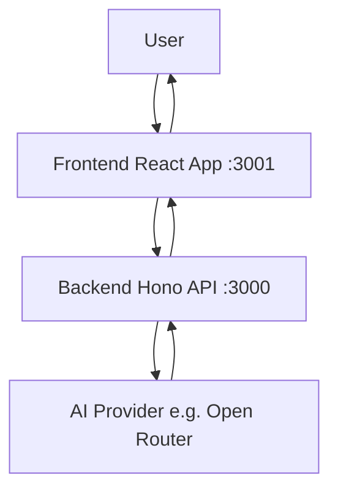

# AGENTS.md - open-chat

## What this is
Guidance for Agents when working with this repository. Keep answers concise, verify commands, and prefer links to source over duplication.

## Quickstart commands
- Install: `bun install`
- Dev: `bun dev` (starts both web on :3001 and server on :3000)
- Build: `bun build`
- Start/Preview: `bun dev:web` for web only; `bun dev:server` for server only
- Test: No tests configured yet
- Lint/Format/Types: `bun check-types` for TypeScript across apps
- PWA Assets: `cd apps/web && bun generate-pwa-assets`

## Architecture overview
Frontend (React + Vite + TanStack Router) communicates with backend (Hono API) for AI chat functionality.

- Framework: React on Vite for frontend; Hono on Node for backend.
- Rendering: Client-side rendering with API calls.
- Data flow: User input → Frontend → Backend API → AI provider → Response back.
- Key modules: `apps/web/src/components/ai-elements/` for chat UI; `apps/server/src/routers/` for API endpoints.

## Environment and configuration
- Runtime: Node.js (via Bun 1.2.21), package manager: Bun.
- Env files: `.env.local` for local dev; CI/hosting secrets for preview/prod.
- Required vars:
  - `VITE_SERVER_URL`: Backend API URL (e.g., http://localhost:3000)
  - `OPEN_ROUTER_API_KEY`: API key for Open Router AI provider
  - `CORS_ORIGIN`: Allowed origins for CORS (server)
  - `BETTER_AUTH_SECRET`: Secret for Better Auth
  - `BETTER_AUTH_URL`: Base URL for Better Auth
- See `apps/web/.env.example` and `apps/server/.env.example` for the full list and formats.

## Project structure (high level)
- `apps/web/src/`: Frontend application code, routes, components
- `apps/web/components/`: Shared UI components (shadcn/ui)
- `apps/web/lib/`: Utilities and hooks
- `apps/server/src/`: Backend API code and routers
- `apps/server/src/routers/`: API route definitions
- Config files: `package.json`, `tsconfig.json`, `vite.config.ts`, `bunfig.toml`

## Development workflow
- Typical loop: install → dev → check-types → commit.
- Common tasks: None specific beyond standard dev/build.
- Troubleshooting: Ensure Bun is installed; check ports 3000/3001 are free.

## Deployment
- Hosting: Not configured yet (POC); frontend can be static-hosted, backend needs server hosting.
- Build command: `bun build`; output: `apps/web/dist/` for web, `apps/server/dist/` for server.
- CI: None configured.
- Post-deploy: None.

## Integrations
- AI SDK: Used for AI chat functionality; see `@ai-sdk/react` in web, `ai` in server.
- Open Router: AI provider for LLM access; requires `OPEN_ROUTER_API_KEY`.
- Better Auth: Authentication library; configured in server with `BETTER_AUTH_*` vars.
- Others: None.

## References
- Source files: `README.md`, `package.json`
- Dashboards: Open Router dashboard for API keys
- Read more: README, roadmap in README
